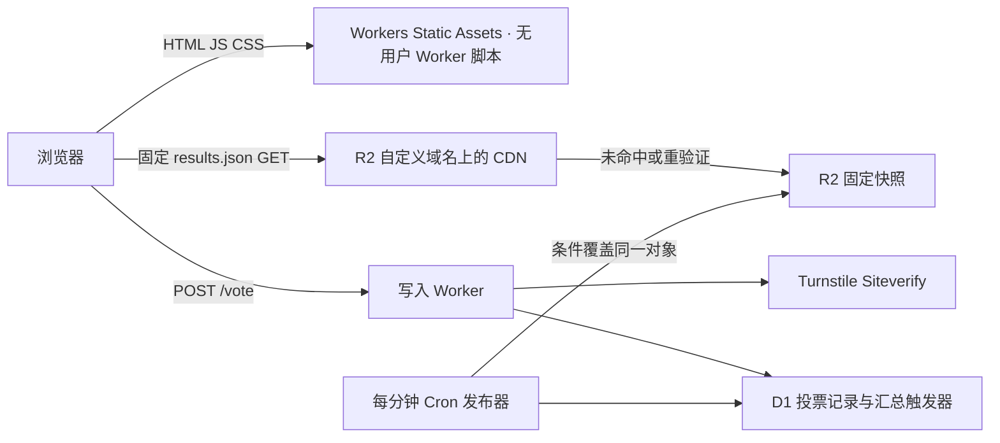

# Cloudflare 投票快照模板

这是本地可运行、已做 workerd 测试的架构示例。没有部署到 Cloudflare，没有创建资源，也没有向原投票站发送请求。它不是已经验证过线上缓存命中率、真实 Turnstile 或费用的生产套件。

## 请求路径与取舍



- 前端独立配置 `wrangler.web.jsonc`，只有静态资源，没有 `main` 用户 Worker。业务 API 不提供 GET 票数端点。
- 前端读取 URL 固定，默认每 10 秒完成一次请求后安排下次读取；后台页面暂停，失败后 20/40/60 秒退避。不添加时间戳，不设置 `no-store`，不自动回退调用动态 Worker。
- 每张成功票先完成 D1 原子写入、去重和汇总触发器，再返回成功。普通 Worker 内存不保存未落盘票。
- 模板选择启用后 Cron **每分钟**发布，不是每 15 秒；提交的配置默认 `crons=[]`，避免仅复制部署就启动后台收费。健康且调度准时的情况下，60 秒发布 + 10 秒 CDN TTL + 约 10 秒客户端轮询，约 80 秒是条件目标，**不是延迟上界或 SLA**。失败、拥塞、缓存逐出会改变行为。前端超过 120 秒标记更新延迟。15 秒方案需另外实现并验证 DO alarms 或可靠发布调度器。
- 快照使用固定 `results.json`，包含 D1 同一条 SELECT 取得的计数、单调 revision 和 capturedAt。先 HEAD 捕捉 R2 etag，再读 D1，最后条件 PUT；发生并发条件失败时丢弃本次旧快照，等待下一次发布。首次对象用 `If-None-Match: *`，已有对象用 `If-Match`。没有无限增长的版本对象。
- revision 用来识别客户端读到的旧快照，不是让 CDN 执行业务判断。CDN 按 HTTP 缓存规则与 TTL 处理数据。

## 本地使用

要求 Node.js 22 或更新版本；本次验证使用 Node.js 24.20.0。锁文件固定 Wrangler 4.147.0 和它当前依赖的 Miniflare 5.20261001.0-alpha。Miniflare 名称带 alpha，升级必须重新执行测试，不能把本地模拟器版本等同于云端部署版本。

```sh
npm ci
npm run check
npm test
npm run demo:check
npm run demo
```

本地演示地址 `http://127.0.0.1:8788/`。演示只监听回环地址，D1/R2 数据存在 `.local-demo/`，验证服务由本地桩替代；页面明确标记“本地演示校验”。`demo:check` 自动启动回环服务、验证 HTTP 和一张本地样本票后关闭，样本票只在演示库。演示 adapter 不会被 Wrangler 部署。它不模拟真实 CDN 或真实机器人识别能力。停止后可以删除 `.local-demo/` 重新开始；此目录不包含线上数据。

需要独立调试 Wrangler API 时：`npm run schema:local`、`npm run dev:api`。前端可以 `npm run dev:web`；真实 API 默认关闭，`runtime-config.js` 使用示例域名，这两个命令不构成自动接通的本地演示。准备本地变量时复制 `.dev.vars.example` 为被忽略的 `.dev.vars`，通过密码输入框/本地秘密管理器写入；不要在聊天、命令参数或日志中输出值。完整无凭据演示直接使用 `npm run demo`。

`npm run build:check` 只做 Wrangler dry-run 打包，不部署。它可能需要本机工具访问权限；不要把 `--dry-run` 去掉后当作同一种操作。

## 配置入口与部署前准备

先打开实际配置页面，再按官方文档配置。以下都是入口 URL，不要求当前已登录：

| 对象 | 配置入口 |
|---|---|
| Workers / Static Assets、域名、Cron | https://dash.cloudflare.com/?to=/:account/workers-and-pages |
| D1 | https://dash.cloudflare.com/?to=/:account/d1 |
| R2 桶、自定义域名、CORS | https://dash.cloudflare.com/?to=/:account/r2/overview |
| Turnstile widget 与允许域名 | https://dash.cloudflare.com/?to=/:account/turnstile |
| 缓存规则 | https://dash.cloudflare.com/?to=/:account/:zone/caching/cache-rules |
| WAF 与请求限速 | https://dash.cloudflare.com/?to=/:account/:zone/security/waf |
| 账户账单 | https://dash.cloudflare.com/?to=/:account/billing |

1. 使用独立测试账户/资源；创建 D1、专用 R2 桶和 Turnstile widget。资源名、全零 database ID、`example.com` 均为明确占位，不是可用生产配置。**不要复制原项目的资源 ID。**
2. 选择三个独立主机名，例如 `vote.example.com` 静态页、`api.example.com` POST API、`counts.example.com` R2 快照。只对需要的主机名增加自定义域名/路由。API 对除 `/vote` 的请求返回 404，但返回 404 本身仍可能有 Worker 请求费；必须在边缘限制不需要的路径。默认 `workers_dev=false`、`preview_urls=false`、`routes=[]`。
3. 将 D1 ID 与 R2 桶名写入 `wrangler.jsonc`，初始化 `schema.sql`（新资源用 `wrangler d1 execute voting-template-db --remote --file schema.sql`，这是会修改远端数据库的操作，执行前核对目标和备份）。分别将源与 Turnstile hostname 改为真实前端域名，不能混用 `api` 域名；生产配置不允许 localhost。
4. 设置 `TURNSTILE_SECRET` 和稳定的随机 `IP_HASH_SECRET`，用秘密管理器/掩码输入与 stdin 管道导入，不把秘密放进 JSONC、public、argv 或日志。IP 哈希盐轮换会使旧记录无法与新记录按 IP 聚合，需安排策略。
5. 按下一节配置 R2 CORS、JSON 缓存与边缘规则。完成部署前核查并进入受控测试后，才将 `VOTING_ENABLED` 与 `PUBLISH_ENABLED` 改为 `true`，设置 `triggers.crons=["* * * * *"]`，部署 API，再部署静态页并完成下方线上验收。前端 public config 只放站点公钥和公开 URL。

## R2 与 CDN 必须单独配置

R2 桶只放公开快照，不放 IP、投票记录或其他私密对象。绑定桶的自定义域名到 `counts.example.com`，**该域名上不要挂 Worker 路由或 Worker 自定义域名**。关闭 `r2.dev` 开发 URL，避免绕过区域边缘规则。

`config/r2-cors.example.json` 是 Wrangler 使用的 CORS 配置示例，需要替换 origin。应用可使用 `wrangler r2 bucket cors set voting-template-snapshots --file config/r2-cors.example.json`。若在 Dashboard JSON 编辑器导入，按该界面要求转换为规则数组，不保证两者格式一致。改 CORS 后清理旧缓存；跨域 GET 必须带真实 Origin 才能验证返回头。

为 exact hostname + exact path + GET/HEAD 建立 **Cache Rule**：

```text
http.host eq "counts.example.com"
and http.request.uri.path eq "/results.json"
and http.request.method in {"GET" "HEAD"}
```

- Cache eligibility：Eligible for cache（JSON 默认不能假定被缓存）。
- Edge TTL：有 origin Cache-Control 时使用 origin；缺少时不要意外缓存错误页面。代码 PUT metadata 为 `public, max-age=1, s-maxage=10`，意图边缘 10 秒、浏览器 1 秒。
- Browser TTL：Respect origin。不要把浏览器 TTL 强行拉长。
- JSON URL 无业务 query 参数；设置边缘规则拒绝非空查询字符串，或经评估将这个公开固定对象的 cache key 忽略 query，避免 cache-busting 回源。不能把“忽略 query”无差别应用到其他业务。
- Cache Rule 的可选 Edge TTL 值和 origin header 行为受套餐与配置影响。如果界面只能选择更大的覆盖 TTL，**不要声称已实现 10 秒**；先使用尊重 origin 的设置，再实际测量 Age、对象更新和回源操作。如果 10 秒无法满足，修改业务新鲜度目标。
- 需要时开启 Smart Tiered Cache 聚合回源。不是全球每个节点每 10 秒主动定时取一次；过期后通常由下次请求触发回源/重验证。
- 不要认为 CORS 是访问控制；非浏览器程序仍能直接读公开 JSON。根据实际套餐，在 CDN 边缘对异常请求优先做 WAF Block/Rate Limit；规则要覆盖预览、测试、默认域名等全部入口。本模板 JSON fetch 为 `credentials: omit`，**不兼容直接在 `/results.json` 或 `/vote` 返回 Managed Challenge HTML**。若采用挑战，另行实现 Turnstile pre-clearance、通行 cookie、跨域 credentials/CORS 与缓存策略并验收，不应复制本模板后直接开启挑战。

本模板没有自动创建这些规则，代码内 metadata 不能证明线上规则已经存在。相关行为参考 [R2 public buckets](https://developers.cloudflare.com/r2/buckets/public-buckets/)、[R2 CORS](https://developers.cloudflare.com/r2/buckets/cors/)、[Cache Rules](https://developers.cloudflare.com/cache/how-to/cache-rules/)、[R2 conditional writes](https://developers.cloudflare.com/r2/api/workers/workers-api-reference/)。

## 防刷边界与数据处理

后端固定使用官方 Siteverify endpoint，验证 `success`、准确 hostname、`action=vote`、`cdata=voterId`；8 秒验证超时，失败关闭。不存在生产“跳过验证”变量。测试/演示替换的是 Miniflare 的出站服务，不是部署代码。演示 IP 哈希 secret 固定且仅用于本地样本，不可用于部署。只读取平台 `CF-Connecting-IP`，缺失时不采信客户端 `X-Forwarded-For`。Origin 检查只是浏览器跨站请求门禁，不是用户身份认证；程序可以伪造 Origin，进入 Worker 后拒绝也不能免除该请求的执行费用。

匿名 UUID 去重只能保证同一个标识一票，不能保证同一个自然人一票。清空浏览器可以更换 UUID；Turnstile 不是绝对防刷，IP 可轮换。D1 触发器在同一事务中限制同一 IP 哈希滚动 1 小时最多 10 张成功票，第 11 张拒绝，即使并发提交也不能越过限制。达到阈值后可持续到该窗口内票数降下来；**不是永久封禁 IP**。学校/家庭/NAT 共用 IP 可能误伤，应按用户群调整策略并公示。读请求和无效 POST 仍可能产生 Worker/D1/验证成本：必须配合边缘拦截，不是账单硬上限。

历史票删除会由触发器扣减总数并增长 revision，但不能随意清空 ledger 来做“过期去重数据清理”，否则投票标识与限流历史会丢失。示例没有自动清理票数据。上线前设置明确保留期限、隐私说明、备份与审计规则；IP HMAC 为可关联标识，不等同于完全匿名。账号级匿名用户、付费票和反欺诈体系不在此示例内。

## 费用与停服

读取 CDN HIT 不经过用户 Worker、也不对该请求回源 R2。MISS/重验证可能产生 R2 Class B。每次成功发布额外执行一次 HEAD（Class B）和一次 PUT（Class A）；条件失败、重试、人工查询也要按实际操作计入模型。每分钟发布在 30 天内约 43,200 次 HEAD 与 43,200 次 PUT，不能只算写操作。将这些填入 [规则仓库的费用计算器](https://github.com/KurosawaGeeker/cloudflare-cost-playbook/blob/docs/cloudflare-cost-playbook/docs/cost-model.md)的其他读/写操作输入；POST、D1、Cron、日志和固定订阅继续计费。额度账户共享，不能每个模板单独扣一次。快照小不代表失败缓存免费。查看当前 [Workers](https://developers.cloudflare.com/workers/platform/pricing/)、[R2](https://developers.cloudflare.com/r2/pricing/)、[D1](https://developers.cloudflare.com/d1/platform/pricing/) 价格，本模板不固化单价。

CPU 限制是单次执行限制，预算邮件是提醒；两者都不是月账单硬封顶。上线前设置费用告警、能接收通知的人和手工/自动降级演练。`VOTING_ENABLED=false` 停写、`PUBLISH_ENABLED=false` 停发布逻辑是业务开关，进入 Worker 的请求和 Cron 仍可能计费。

完整停服顺序：

1. 保留并备份 D1/R2/配置与账单证据，不先删数据。
2. 将写 API 全部入口在边缘封锁或解除 Worker 自定义域名/路由；确认 `workers.dev`、preview URLs、旧版本/测试 Worker 和服务绑定入口。解除单条域名路由不代表所有入口消失。
3. 移除 Cron triggers（`crons=[]` 并完成配置发布）及其他触发源；业务开关不能替代解除触发器。
4. 禁用 R2 的全部 custom domain 和 `r2.dev` 公共访问，按需要清缓存；仍存在的公开入口可能继续收到请求。
5. 静态页改为维护页并停止轮询，排查仍打开的旧页面。若无需保留服务，可核对后删除 Worker，但不要因此误删数据库备份。
6. 用入口探测、Worker invocation、R2 operations 与账单延迟复核下降趋势；存储、日志保留及账户付费订阅可能继续收费，若要停止需另外处理订阅与资源。

## 验证状态（2026-10-04）

本地测试使用真实 workerd + Miniflare 的 D1/R2 binding，Siteverify 是本地响应桩，全部出站请求被拦截。8 个集成测试通过：提交前持久化、进程重启后幂等、非法/错 hostname/action/cdata/重放 token 不加票、并发 IP 10 票上限和唯一票 revision、迟到 ACK 使用本票 revision 避免重复展示、4 KiB 请求限制、scheduled 发布与 metadata、首次/已有对象两种旧快照乱序覆盖防护。`npm run check`、API/静态页两项 Wrangler dry-run 和本地 HTTP demo 冒烟验证通过；dry-run 未部署。未进行浏览器视觉检查或线上请求压力测试。

| 人工上线验收 | 状态与所需证据 |
|---|---|
| 真正 Turnstile | 待验证：真实域名、真实 widget 与 Siteverify；失败 token 不写库，允许/拒绝能在 analytics 对上 |
| 静态请求不执行用户 Worker | 待验证：受控少量静态资源探测与 invocation 对照；不存在 Worker-first/middleware |
| JSON CDN 缓存 | 待验证：同 URL 不同时间/区域的 HIT、Age、最新 revision，R2 回源计数；本地 metadata 不足以证明 |
| 跨域缓存 CORS | 待验证：真实浏览器 Origin 在 HIT/MISS 都有正确头；更改政策后 purge |
| 发布与新鲜度 | 待验证：Cron 真实执行、故障告警、延迟超过目标时能看见 stale 状态 |
| 防直连/缓存击穿 | 待验证：默认/预览/旧域名关闭，query-busting 与异常 POST 在边缘被限制 |
| 真实账单改善 | 待验证：匹配周期与资源范围，比较 Worker/R2/D1 operation 和总费用，不用 1 个 HIT 推断全站 |
| 告警与停服 | 待验证：邮件/通知送达和完整入口关闭演练，记录传播和账单延迟 |

本模板已验证本地持久化与并发正确性，线上配置与费用验收必须另行完成。来源核对日期 2026-10-04；[Static Assets routing](https://developers.cloudflare.com/workers/static-assets/routing/worker-script/)、[Turnstile server validation](https://developers.cloudflare.com/turnstile/get-started/server-side-validation/)、[Cron Triggers](https://developers.cloudflare.com/workers/configuration/cron-triggers/)、[Workers best practices](https://developers.cloudflare.com/workers/best-practices/workers-best-practices/)。
